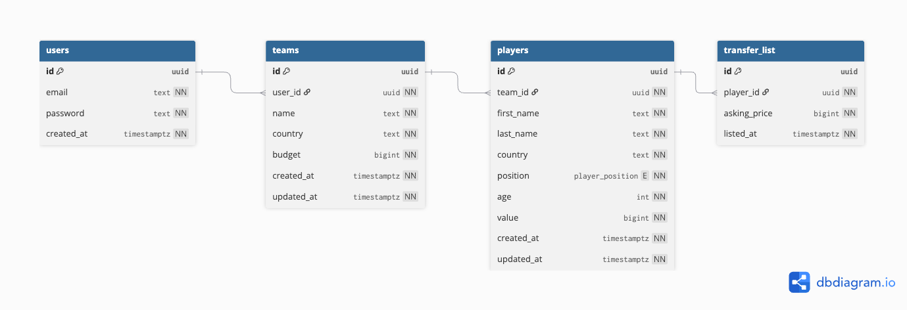

# Soccer Manager API

A RESTful API for managing fantasy football teams. Users register, receive a squad of 20 players, and can buy or sell players on a transfer market.

## Database Schema



---

## Tech Stack

| Layer | Tool |
|---|---|
| Language | Go 1.26.1 |
| HTTP framework | Gin |
| Database | PostgreSQL 16 (via Docker) |
| Driver / pool | pgx/v5 + pgxpool |
| Query generation | sqlc |
| Migrations | golang-migrate |
| Auth | JWT (golang-jwt/v5) + bcrypt |
| Localisation | go-i18n (English + Georgian) |
| Rate limiting | golang.org/x/time/rate |
| API docs | swaggo/swag (OpenAPI 3) |

---

## Prerequisites

- [Go 1.26+](https://go.dev/dl/)
- [Docker](https://www.docker.com/) and Docker Compose

---

## Setup

```bash
git clone https://github.com/faikbairamov/soccer-manager.git
cd soccer-manager

cp .env.example .env        # review and adjust if needed

make docker-up              # start PostgreSQL in Docker
make migrate-up             # apply all schema migrations
make run                    # start the API on :8080
```

The server is ready when you see `"server starting"` in the logs.

---

## Endpoints

### Public

| Method | Path | Description |
|---|---|---|
| `GET` | `/health` | Health check — 200 if DB is up, 503 if not |
| `GET` | `/swagger/index.html` | Swagger UI |

### Auth (rate-limited: 5 req/s, burst 10)

| Method | Path | Description |
|---|---|---|
| `POST` | `/api/v1/auth/register` | Create account + auto-generate 20-player squad |
| `POST` | `/api/v1/auth/login` | Authenticate and receive a JWT |

### Teams (JWT required)

| Method | Path | Description |
|---|---|---|
| `GET` | `/api/v1/teams/me` | Get your team and total squad value |
| `PATCH` | `/api/v1/teams/me` | Update team name and/or country |

### Players (JWT required)

| Method | Path | Description |
|---|---|---|
| `GET` | `/api/v1/players/:id` | Get a player's details |
| `PATCH` | `/api/v1/players/:id` | Update a player's first name, last name, or country (owner only) |

### Transfer Market (JWT required)

| Method | Path | Description |
|---|---|---|
| `GET` | `/api/v1/transfers` | List all players on the market (`?page=1&limit=20`) |
| `POST` | `/api/v1/transfers` | Put one of your players on the market with an asking price |
| `DELETE` | `/api/v1/transfers/:id` | Remove your player from the market |
| `POST` | `/api/v1/transfers/:id/buy` | Purchase a listed player |

---

## Swagger UI

With the server running, open:

```
http://localhost:8080/swagger/index.html
```

You can authorise with a JWT token and try every endpoint directly from the browser. The Postman collection is available at `docs/soccer-manager.postman_collection.json`.

---

## Localisation

Send `Accept-Language: ka` to receive error messages in Georgian. Omit the header or send `Accept-Language: en` for English.

---

## Design Decisions

**UUID primary keys** — Sequential integer IDs leak row counts and make resource enumeration trivial. `gen_random_uuid()` produces unguessable identifiers with no information disclosure.

**BIGINT for money** — Floating-point types cannot represent all decimal fractions exactly (`0.1 + 0.2 ≠ 0.3`). Player values and budgets are stored as whole numbers (cents/dollars) in `BIGINT` to eliminate rounding errors entirely.

**pgxpool** — Opening a new TCP connection + TLS handshake + Postgres auth on every HTTP request adds 5–20 ms of latency and caps throughput at Postgres's connection limit. The pool keeps connections warm and reuses them across requests.

**sqlc** — Raw `rows.Scan` is verbose and error-prone; full ORMs hide SQL and make query tuning hard. sqlc is the middle ground: you write SQL, it generates type-safe Go — schema and queries stay in sync automatically.

**Atomic transfer** — Buying a player touches four tables (debit buyer, credit seller, move player, delete listing). All four writes happen inside a single database transaction via `store.WithTx`. If any step fails, the whole operation rolls back — no partial state is ever committed.

**Graceful shutdown** — On `SIGINT`/`SIGTERM` the server stops accepting new connections and waits up to 30 seconds for in-flight requests to finish before exiting, preventing mid-request data corruption.

**Stateless JWT auth** — The server signs a token containing the user ID at login. Every subsequent request carries the token; the server verifies the signature without a database lookup. No session storage needed.
